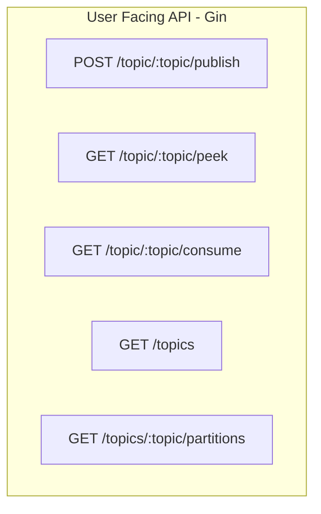
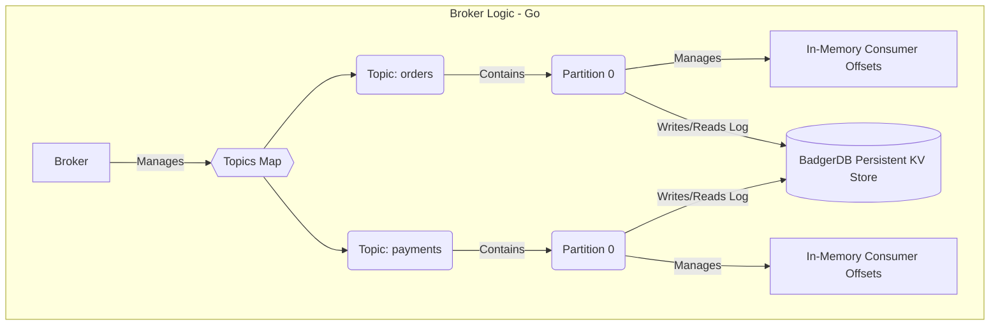

# 🦅 FalconQ – Distributed Message Queue with Priority-Based Messaging

FalconQ is a high-performance distributed message queue inspired by Apache Kafka, built in Go. It supports topic-based pub/sub, queue-based consumption, consumer offset tracking, **persistent storage**, **Raft-based consensus**, and **priority-aware message delivery** — all from scratch.

> 🚀 Designed to showcase system design, distributed systems, and production-level Go backend skills. FAANG-ready.

---

## 📦 Features

- ✅ **Topic-based publish/subscribe** via REST API
- ✅ **High vs Low priority queueing** (handled during consumption)
- ✅ **Offset-tracked consumption** per consumer ID
- ✅ **Persistent Commit Log** using **BadgerDB**
- ✅ **Per-partition Raft leader election & replication**
- ✅ **Partitioning via Consistent Hashing + Round Robin fallback**
- ✅ **Batch consumption support**
- ✅ **Admin endpoints** for topic/partition/raft stats
- 🔜 Prometheus + Grafana observability
- 🔜 Chaos testing & 1.5M msg/min stress testing

---

---

## 🚀 Getting Started

1.  **Prerequisites:**
    *   Go (version 1.18+ recommended) installed.
2.  **Clone the repository:**
    git clone https://github.com/tejakusireddy/FalconQ-distributed-message-queue.git
    cd falconq
3.  **Install dependencies:**
    go mod tidy
4.  **Update config.yaml with Raft & HTTP addresses for all nodes:**
5.  **Run 3 nodes (each in a separate terminal):**
    Make sure you are in the root directory of the project
    Terminal 1
     go run broker/main.go -config broker/config.yaml -nodeid node1

    Terminal 2
     go run broker/main.go -config broker/config.yaml -nodeid node2

    Terminal 3
     go run broker/main.go -config broker/config.yaml -nodeid node3
    
6.  **Use `curl` (or other tools) to interact with the API** (see examples below).

---

## 🚦 API Endpoints

| Method | Route                                       | Description                                     |
|--------|---------------------------------------------|-------------------------------------------------|
| `POST` | `/topic/:topic/publish`                     | Publish a message (JSON: `message`, `priority`) |
| `GET`  | `/topic/:topic/consume?consumerID=X&batch=N`| Consume N messages (offset tracked)             |
| `GET`  | `/topic/:topic/peek?offset=X&batch=N`       | Peek messages starting at offset (no consumption) |
| `GET`  | `/topics`                                   | List all active topic names                     |
| `GET`  | `/topics/:topic/partitions`                 | View partition IDs for a specific topic         |
---

### 🧪 Example Usage (CURL)

#### Publish messages to the 'orders' topic
curl -X POST http://localhost:8080/topic/orders/publish \
  -H "Content-Type: application/json" \
  -d '{"message": "🔥 Urgent refund request #RF001", "priority": "high"}'

curl -X POST http://localhost:8080/topic/orders/publish \
  -H "Content-Type: application/json" \
  -d '{"message": "🧊 Normal order placement #ORD001", "priority": "low"}'

curl -X POST http://localhost:8080/topic/orders/publish \
  -H "Content-Type: application/json" \
  -d '{"message": "🔥 Critical stock update #SKU001", "priority": "high"}'

Consume messages for consumer 'worker1' (gets high priority first)
First call:
curl "http://localhost:8080/topic/orders/consume?consumerID=worker1&batch=2"
Example Response: 
[{"v":"🔥 Urgent refund request #RF001","p":"high","Offset":0},{"v":"🔥 Critical stock update #SKU001","p":"high","Offset":2}], nextOffset: 3

Second call (will get low priority if available):
curl "http://localhost:8080/topic/orders/consume?consumerID=worker1&batch=2"
Example Response: 
[{"v":"🧊 Normal order placement #ORD001","p":"low","Offset":1}], nextOffset: 2 (Note: actual offset depends on internal filtering)

Peek messages starting from offset 0 (gets high priority first)
curl "http://localhost:8080/topic/orders/peek?offset=0&batch=5"

View topics/partitions
curl http://localhost:8080/topics
Example Response: {"topics":["orders"]}

curl http://localhost:8080/topics/orders/partitions
Example Response: {"partitions":[{"id":0}],"topic":"orders"}

🧠 Architecture 

Architecture below illustrates how messages flow from REST → Broker → BadgerDB

  Publish --> Broker  
  Peek --> Broker  
  Consume --> Broker  
  Topics --> Broker  
  Partitions --> Broker  

🛠️ Tech Stack  
Language: Go  
Framework: Gin (for REST API)  
Data Store: BadgerDB (Persistent Key-Value Store / Commit Log)  
Coordination: Planned Raft via hashicorp/raft  
Observability: Planned Prometheus + Grafana  

🛣️ Roadmap  
✅ Phase 1 – In-memory priority queue concept, REST APIs  
✅ Phase 2 – Add persistent commit log with BadgerDB  
✅ Phase 3 – Partitioning implementation (Consistent Hashing)  
✅ Phase 4 – Raft-based leader election and replication  
➡️ Phase 5 – Kubernetes (EKS) deployment + Chaos Mesh  
➡️ Phase 6 – Metrics, Tracing, Dashboard  

👨‍💻 Authors  
Sai Teja Kusireddy    
Snehith Kongara  

🏁 License
MIT — feel free to fork, star, and build on top of it.

---

